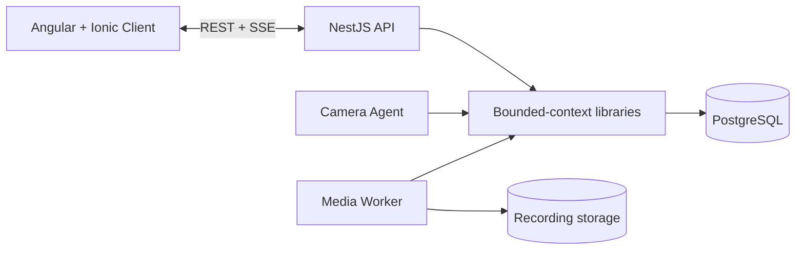
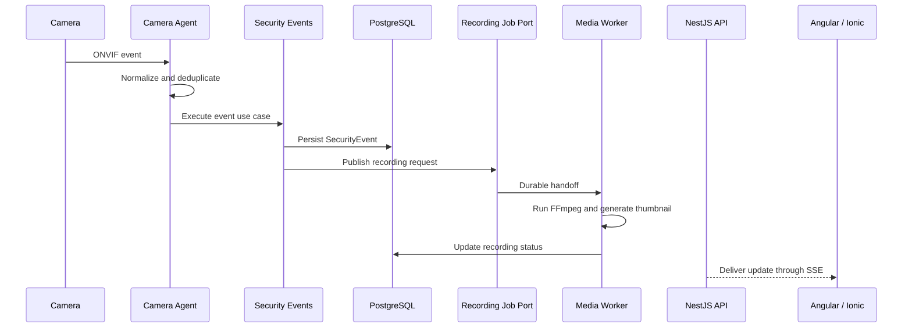

# Sentinel Security Event Hub

> A security-camera event platform designed to ingest ONVIF events, coordinate automated recordings, and deliver real-time alerts through a shared web, PWA, and mobile client.


## Overview

Sentinel is a ground-up redesign of a legacy Next.js security-monitoring application. The new version separates the client, HTTP API, camera connectivity, and media processing into explicit architectural boundaries rather than performing all responsibilities inside one runtime.

The project is being developed as a production-oriented full-stack engineering case study, with emphasis on:

- real-time event delivery;
- resilient ONVIF camera connectivity;
- isolated FFmpeg processing;
- durable and idempotent workflows;
- secure handling of camera credentials and media;
- explicit dependency boundaries;
- testable, maintainable application design;
- measurable performance and operational reliability.

> **Current status:** the repository foundation is in active development. The Angular/Ionic client scaffold and the NestJS multi-process workspace have been created and verified. Business features, PostgreSQL persistence, ONVIF processing, FFmpeg orchestration, and SSE integration remain planned work and are not presented as completed.

## What This Project Demonstrates

Sentinel is intended to demonstrate more than framework usage. Its main engineering concerns are system boundaries, failure handling, data durability, and long-term maintainability.

- **Full-stack architecture:** Angular/Ionic client, NestJS backend, REST, SSE, and generated OpenAPI contracts.
- **Multi-process backend design:** independent API, camera-agent, and media-worker entry points in one controlled codebase.
- **Domain-oriented modularity:** business capabilities are planned as bounded-context libraries rather than controller-centric modules.
- **Asynchronous workflow design:** security events remain available even when media processing fails.
- **Security by design:** encrypted camera credentials, protected media access, role-based authorization, safe logging, and auditability.
- **Operational resilience:** reconnect strategies, heartbeat monitoring, retries, idempotency, deduplication, health checks, and controlled FFmpeg concurrency.
- **Engineering discipline:** strict TypeScript, atomic changes, code review, automated checks, ADRs, and Conventional Commits.

## Architecture

Sentinel is designed as a **modular monolith with multiple executable processes**: one codebase and one domain model, with isolated runtime responsibilities.

### Process Model



The executable applications act as **composition roots**:

| Application | Responsibility |
| --- | --- |
| `api` | REST endpoints, SSE, authentication transport, authorization enforcement, OpenAPI, and process configuration |
| `camera-agent` | ONVIF connections, subscriptions, heartbeat, reconnect, event normalization, and deduplication |
| `media-worker` | recording-job consumption, FFmpeg lifecycle, thumbnails, retries, retention, and storage reconciliation |

Reusable business rules and use cases belong to backend libraries, not to the executable applications.

### Target Event Lifecycle



A critical invariant is built into the design:

> The security event is persisted before a recording job is published. If FFmpeg fails, the event remains visible and the recording is marked as failed.

## Architectural Decisions

### One Codebase, Separate Processes

Long-lived camera connections and CPU-intensive media work are kept outside the HTTP process. This prevents camera or FFmpeg failures from directly destabilizing API request handling while preserving shared domain logic and consistent tooling.

### Bounded Contexts in Libraries

Business capabilities are planned as libraries such as:

- `identity`;
- `authorization`;
- `cameras`;
- `security-events`;
- `recordings`;
- `notifications`;
- `audit`.

Each context follows a layered structure:

```text
domain          → entities, value objects, invariants
application     → use cases, ports, orchestration
infrastructure  → Prisma and external-system adapters
presentation    → transport DTOs, controllers, and mapping
```

The domain layer remains independent from NestJS, Prisma, HTTP, and queue technology.

### REST and SSE

REST is used for authentication, resource management, querying, and state changes. SSE is planned for authenticated real-time delivery of new events, recording updates, camera status changes, and active notifications.

The SSE design includes heartbeat messages, reconnection, deduplication, connection limits, and missed-event recovery through `Last-Event-ID` or an equivalent mechanism.

### OpenAPI as the Contract Boundary

The frontend does not import backend DTOs, Prisma models, or NestJS code. API contracts are exposed through OpenAPI and consumed through a generated Angular client, followed by explicit API-model-to-UI-model mapping.

### Evolutionary Infrastructure

PostgreSQL is the initial persistence target. Redis, BullMQ, and S3-compatible storage are not introduced by default. They are added only when a documented problem and an architecture decision justify their operational cost.

## Technology Stack

### Verified Foundation

| Area | Technology |
| --- | --- |
| Client | Angular `20.3.32`, Ionic Angular `8.8.14` |
| Client architecture | Standalone components, strict TypeScript, zoneless change detection, lazy routing |
| Backend | NestJS monorepo with three executable applications |
| Backend language | TypeScript in strict mode |
| Backend testing | Unit and end-to-end test suites |
| Version control | Git with Conventional Commits and atomic changes |

### Planned Integrations

| Area | Technology or approach |
| --- | --- |
| Persistence | Prisma with PostgreSQL |
| Camera integration | ONVIF and RTSP |
| Media processing | FFmpeg |
| Real-time communication | Authenticated Server-Sent Events |
| API contract | OpenAPI-generated Angular client |
| Native delivery | Capacitor for Android and later iOS support |
| Optional queue infrastructure | Redis and BullMQ, subject to an ADR |
| Optional object storage | S3-compatible adapter, subject to an ADR |

## Repository Structure

The current verified foundation is organized as follows:

```text
sentinel-event-hub-v3/
├── frontend/                         # Angular + Ionic client
├── backend/                          # NestJS monorepo workspace
│   ├── apps/
│   │   ├── api/                      # HTTP API composition root
│   │   ├── camera-agent/             # ONVIF process boundary
│   │   └── media-worker/             # FFmpeg process boundary
│   ├── libs/
│   │   ├── infrastructure/           # Shared technical infrastructure
│   │   ├── persistence/              # Persistence runtime foundation
│   │   └── shared/                   # Stable framework-agnostic primitives
│   └── prisma/                       # Reserved for schema and migrations
└── .gitignore
```

Additional business libraries and documentation directories will be introduced only when their first real use case requires them.

## Current Implementation Status

| Area | Status |
| --- | --- |
| Product-level repository with separate `frontend/` and `backend/` projects | Verified |
| Angular client scaffold | Verified |
| Ionic Angular integration | Verified |
| Angular routing, SCSS, standalone mode, strict TypeScript, and zoneless configuration | Verified |
| Frontend build after Angular and Ionic setup | Passing |
| Initial frontend tests | `2/2` passing |
| NestJS monorepo configuration | Verified |
| `api`, `camera-agent`, and `media-worker` application scaffolds | Verified |
| `persistence`, `infrastructure`, and `shared` backend libraries | Verified |
| Backend build | Passing |
| Backend lint | Passing without errors or warnings |
| Backend unit tests | Passing |
| Backend end-to-end tests | Passing |
| Frontend feature routing | In progress |
| Prisma and PostgreSQL | Planned |
| Security Events vertical slice | Planned |
| ONVIF camera integration | Planned |
| FFmpeg recording workflow | Planned |
| Authenticated SSE | Planned |
| Capacitor native builds | Planned |

## Quality Gates

### Backend

```bash
cd backend
npm install
npm run build
npm run lint
npm run test
npm run test:e2e
```

### Frontend

```bash
cd frontend
npm install
npm run build
npm test
```

A task is considered complete only after the relevant implementation, naming, dependency boundaries, strict typing, error handling, security concerns, tests, and build output have been reviewed.

## Roadmap

### Foundation

- [x] Create the product-level repository.
- [x] Create the Angular and Ionic client foundation.
- [x] Create the NestJS monorepo foundation.
- [x] Separate API, camera-agent, and media-worker process boundaries.
- [ ] Complete and verify the frontend application shell and Events routing.
- [ ] Document architecture decisions and dependency boundaries.

### Persistence and Security

- [ ] Configure Prisma and PostgreSQL.
- [ ] Add database lifecycle and health checks.
- [ ] Implement identity and authentication.
- [ ] Implement role-based authorization and audit logging.

### First Vertical Slice

- [ ] Build the Events interface with mock data.
- [ ] Implement the `security-events` bounded context.
- [ ] Expose paginated Events REST endpoints.
- [ ] Generate the OpenAPI Angular client.
- [ ] Replace mock data with the real API integration.

### Camera and Media Pipeline

- [ ] Add secure camera management.
- [ ] Implement ONVIF subscriptions and reconnect behavior.
- [ ] Normalize and deduplicate camera events.
- [ ] Define the durable recording-job handoff.
- [ ] Implement FFmpeg recording and thumbnail generation.
- [ ] Add idempotency, retries, retention, and reconciliation.

### Real-Time and Native Delivery

- [ ] Add authenticated SSE with heartbeat and missed-event recovery.
- [ ] Update Angular Signals from the event stream.
- [ ] Add Capacitor integrations and Android delivery.
- [ ] Add secure storage, push notifications, and limited offline support.

### Production Readiness

- [ ] Add threat modelling and security hardening.
- [ ] Add structured logging, correlation IDs, metrics, and alerts.
- [ ] Establish performance baselines and resilience tests.
- [ ] Add CI/CD, dependency scanning, deployment, C4 diagrams, and ADRs.

## Engineering Principles

- Keep the frontend and backend contractually separate.
- Keep executable applications focused on composition and process lifecycle.
- Keep business logic inside clearly owned bounded contexts.
- Persist security events before starting fallible media work.
- Prefer explicit ports and adapters over direct infrastructure coupling.
- Introduce distributed infrastructure only after a measured need exists.
- Protect camera credentials, RTSP URLs, tokens, and sensitive logs.
- Design recording jobs and event handling for idempotency.
- Apply strict typing, focused tests, and atomic commits throughout development.
- Document important trade-offs through Architecture Decision Records.

## Portfolio Context

Sentinel is an independent full-stack engineering project focused on modern application architecture, real-time systems, media-processing isolation, and production-oriented engineering practices. It is being developed incrementally so that every documented capability corresponds to reviewed and verified implementation rather than an unvalidated architecture claim.
